##   制作体积视频MODE教程
#### 体积视频MODE简介

MODE在体积视频中人表现形式。我们在体积视频看到的内容，就是模型的序列（可以理解为3D的序列图）。

#### 体积视频常用模型制作软件 
* MAYA 

* 3DSMAX 

* ZBrush 等等
 
 体积视频需要MODE格式为常用格式OBJ,我们以MAYA为例为大家介绍制作要点以及需要注意的地方。

#### 体积视频制作流程及要点

【一】导入文件

打开软件后，导入OBJ格式文件（ 选择路径：file - import  - 选择文件路径）
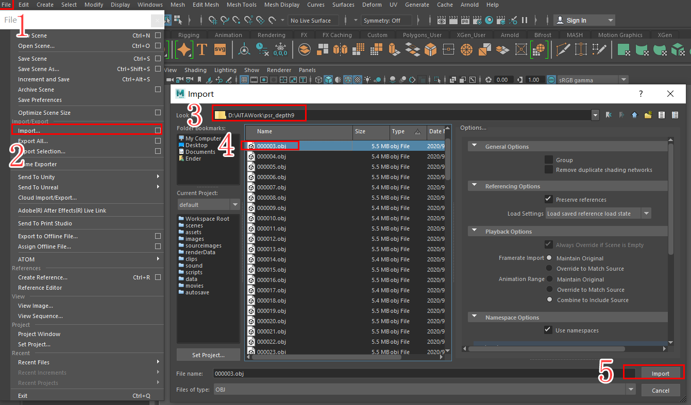

【二】制作模型

1、以扫描模型T_POSE模型，创建Ploy模式 BASE模型，模型需要以4边面，模型必须是一个整体模型。

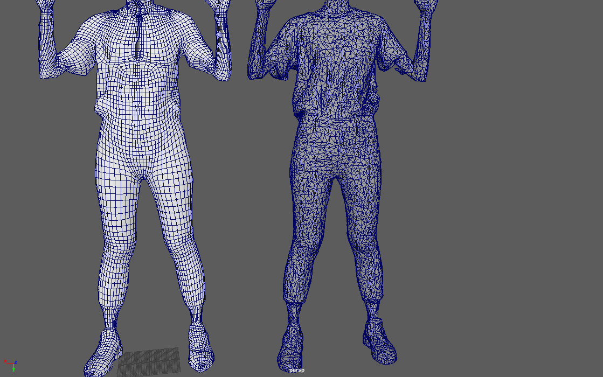
备注:Manifold，这也是最重要的。3D模型必须为manifold。如果一个网格模型中存在多个（3个或以上）面共一条边，那么它就是non-manifold，因为这个局部区域由于自相交而无法摊开展平为一个平面了。请看如图所示这个4个面共享一条边的non-manifold例子： 

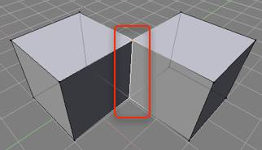

2、模型创建完成后，展开模型UV,展开方法根据模型材质类型和部位进行展开(UV分为：脸、头、头发、耳朵、手张和手指、手臂，衣服、裤子、腿、鞋子、口腔、牙齿)

3、为模型赋予材质球，根据UV分开的部位，分别指定材质球
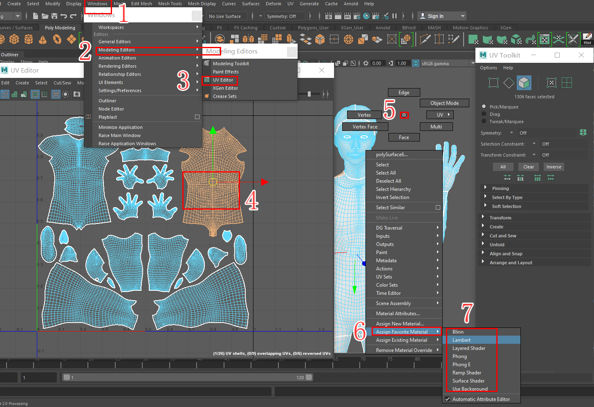

4、模型制作完成后清理所有历史(edit - Delete by Type - History)
清理完成后图4没有残留历史步骤,5的参数为初始值.
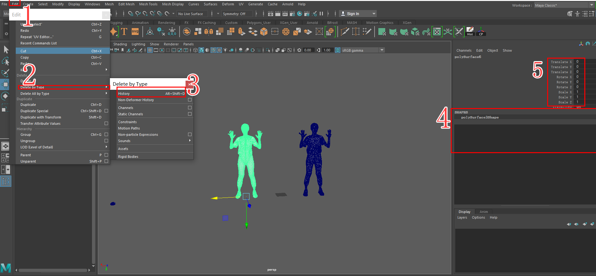
5、模型导出设置(file - Export selection - 导出路径 - 导出命名 - 导出设置 - 确定导出)
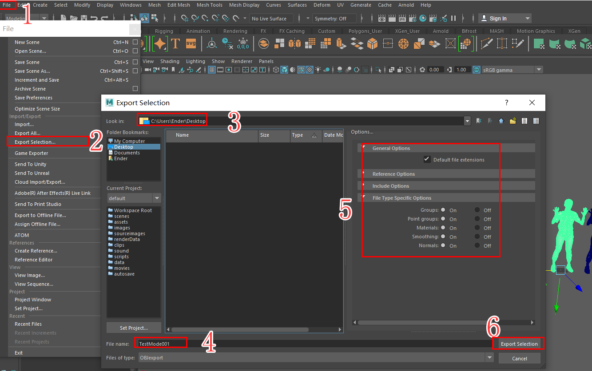
6、检查模型 需要用到 MeshLab 软件, 打开MeshLab软件(file  - import mesh - 选择刚才导出的OBJ - 点开no -manifvers和 no - manifedges - 查看左上角是否有non -manifold Edge 和 Vertices).如果有non -manaflod此软件会标记,返回MAYA中去修改,重复5`6确定无误模型制作完成.
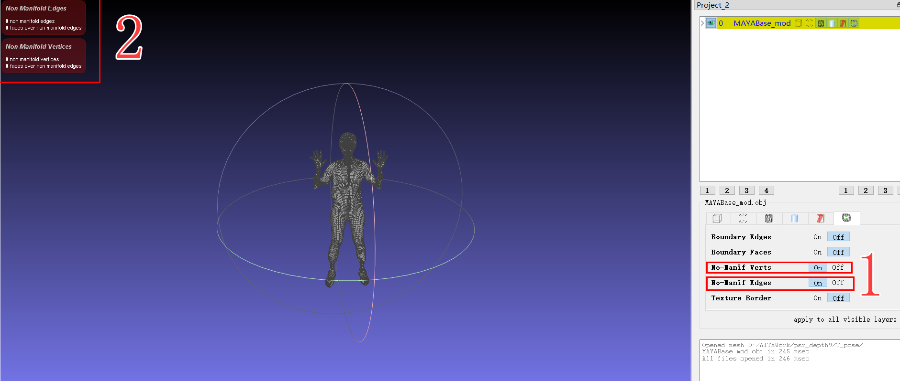

【三】拟合模型序列

需要 Wrap 软件工具
 
1、打开Wrap 导入MAYA中制作完成人MODE  (load - 命名 - 加载 - 选择文件 - 导入) 
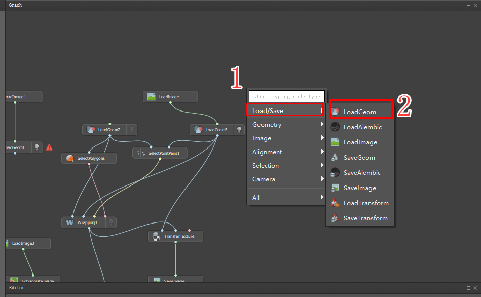
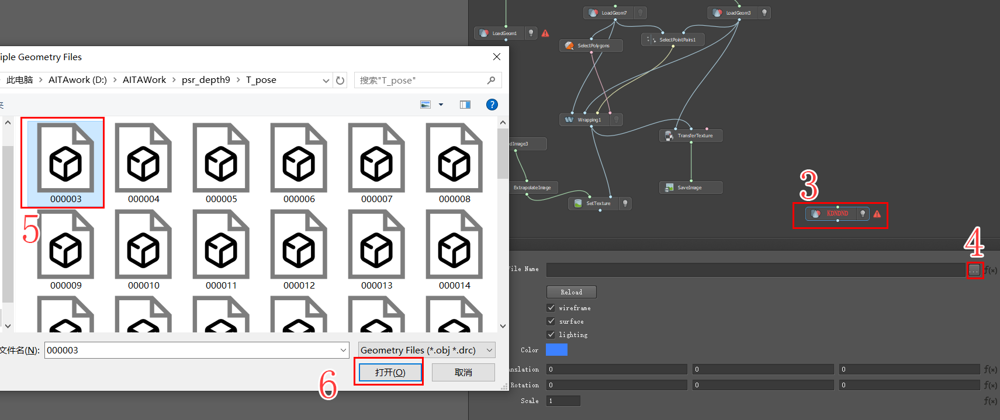
2、同1导入模型序列
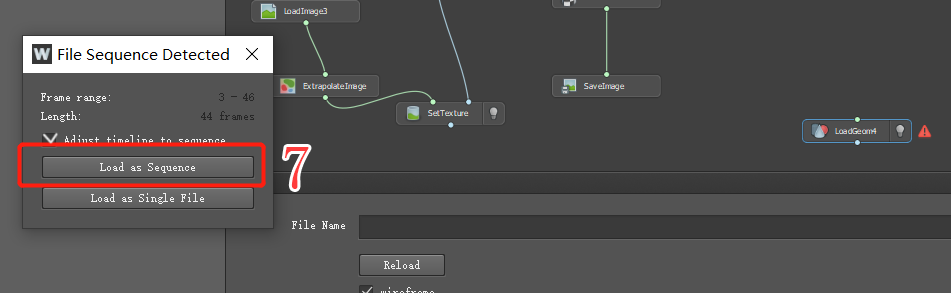
3、右击创建SelectPiontPairs,选择此节点，进入VisualEditor界面进行MOSDE和序列模型标定关键位置点。
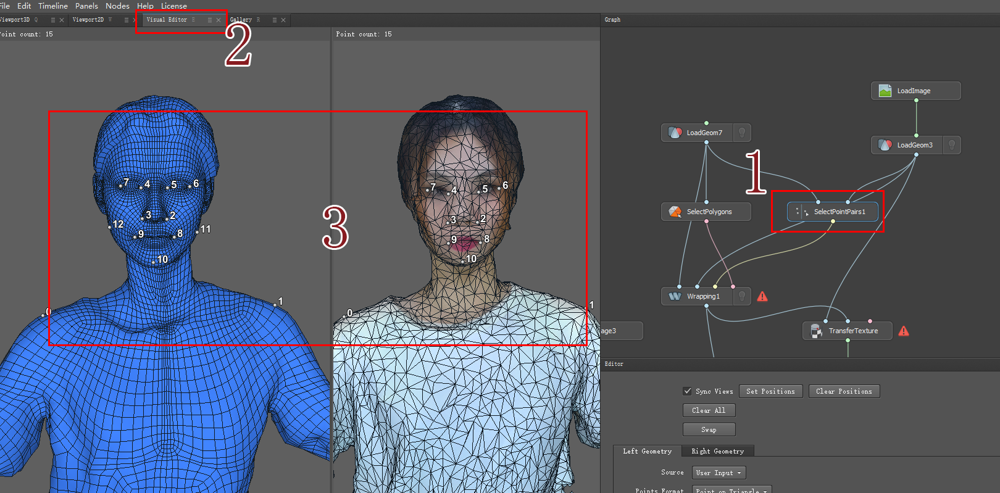
4、右击创建SelectPolygons，选择节点同样进入Editor界面，选择不需要参与结算人面！
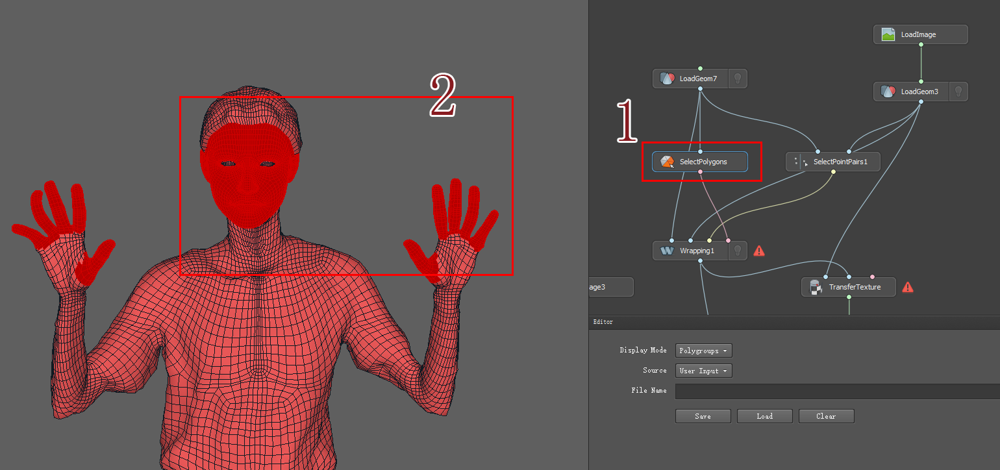
5、同上操作创建Wrapping，以上步骤完成后，点击Copute结算。
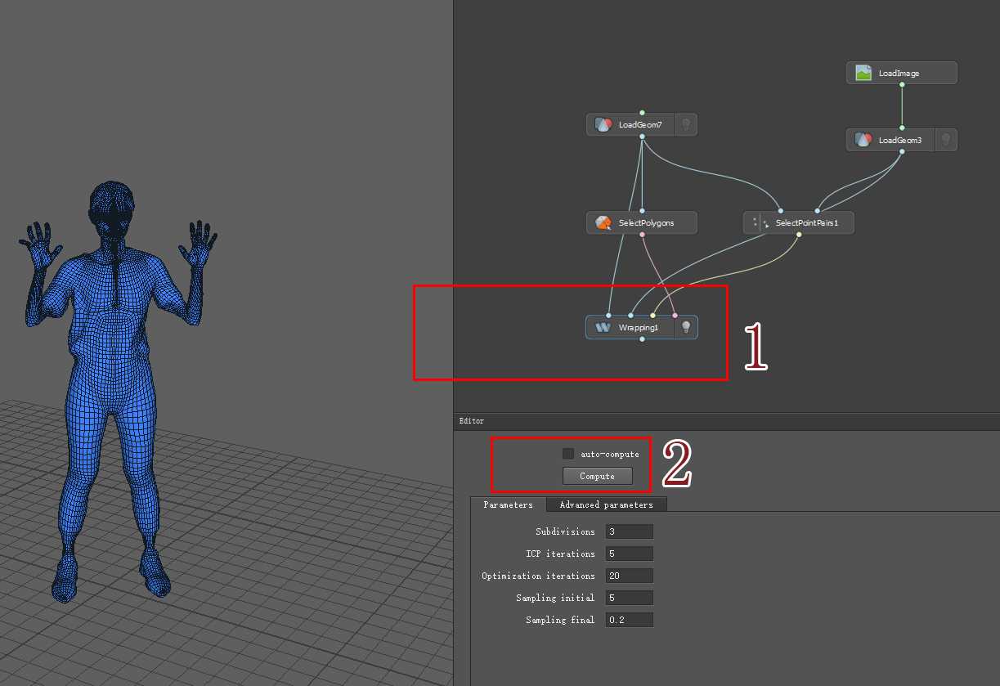 
6、贴图拟合优化制作，将SaveImage在PS软件里进行精致优化，最后SetImage给MODE。
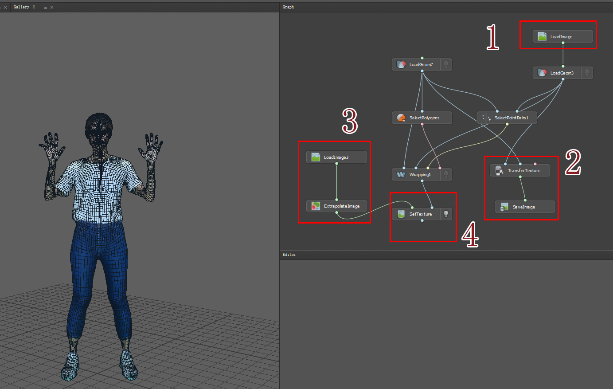
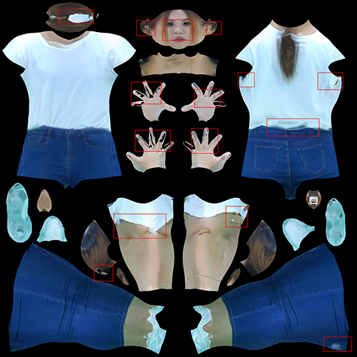   
整个体积视频MODE制作完成。

