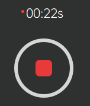

[返回](promholostudio.md#id_promholostudio)

#Holo录播
## 功能介绍
Holo录播模块为用户提供人体容积视频素材的本地录制功能，用户完成素材的录制后还需要到[录播编辑](page_holoEdit.md#id_page_holoEdit)模块完成人体容积视频素材的预览、编辑和导出。界面上分为左边的[视频预览区](#capture_previewArea)、右上方的[点云预览区](#capture_pointcloudArea)和右下方的[拍摄操作区](#capture_captureArea)。

## 操作指南
###视频预览区
视频预览区采用类似九宫格的矩阵排列方式，显示当前所有接入系统相机的视频画面预览。每台相机在各自画幅上均按照左边彩色图右边深度图的方式予以布局，彩色图/深度图上方将显示该相机的相机名称-图像类型后缀（例如：相机00的彩色图为00-color，对应的深度图为00-depth），而如果该相机是主相机的话，则会在相机名称前冠以[main]字样（例如：相机00为主相机，其彩色图为[main]00-color，对应的深度图为[main]00-depth）。

###点云预览区
点云预览区将实时显示全息容积拍摄棚当中的人体点云模型。用户可以通过鼠标或键盘对点云模型的观察视角进行操控。

**支持的鼠标/键盘操作**：
* 鼠标滚轮：视角缩放。
* 鼠标左键拖拽：视角旋转。
* 鼠标中键拖拽：视角平移。
* 键盘R键：视角重置。

###拍摄操作区
拍摄操作区负责引导用户完成人体容积视频素材的本地录制工作。具体操作流程如下：

#### 1.指定拍摄根目录

用户在文本框当中输入拍摄任务的根目录路径（也可点击“浏览”按钮，在弹出的路径选择弹窗中选择指定该路径），该目录将存储拍摄录制的人体容积视频素材文件。
*注意：当从其他功能模块跳转到holo录播模块时，将弹出拍摄根目录的设定弹窗，用户也可以在该弹窗当中先行设定该目录路径。*

#### 2.打开/关闭相机
 / 
用户点击“打开相机”按钮，将刷新、打开所有接入系统的相机设备（该操作将核对当前接入系统的相机设备授权信息，对于非法授权的相机设备将不予支持，具体请参考[相机授权](promholostudio.md#CameraLicense)部分的描述）；成功打开相机后，[视频预览区](#capture_previewArea)将显示当前所有接入系统相机的视频画面预览，同时[点云预览区](#capture_pointcloudArea)将实时显示全息容积拍摄棚当中的人体点云模型；用户再次点击该按钮（此时该按钮显示“关闭相机”字样）将关闭所有的相机设备。
*注意：有可能因设备连接不良而导致某些相机设备无法刷新/打开，此时用户需根据软件的反馈检查相机设备的连接情况，尝试重新拔插设备并再次刷新、打开相机。*

####3.拍摄容积视频素材

 / 

用户在设定好拍摄根目录并且成功打开相机之后，可以开始拍摄容积视频素材。容积视频素材的拍摄模式分为两种：一种是**录像模式**，另一种是**拍照模式**。**录像模式**将录制一段有限时长的动态视频素材，经[录播编辑](page_holoEdit.md#id_page_holoEdit)模块编辑处理后可以生成一段包含动态内容的容积视频文件（文件名后缀为.mp4），该文件需要配合使用我们提供的专门的播放工具/插件才能播放。**拍照模式**将拍摄一组单帧的静态照片素材，经[录播编辑](page_holoEdit.md#id_page_holoEdit)模块编辑处理后可以生成一份单帧静态内容的三维模型文件（文件名后缀为.obj），该文件支持在如3ds Max、Maya、Sketchup、Blender、Houdini等许多主流建模软件当中查看使用。
1. **录像模式**操作：
用户在拍摄操作区当中点击“录像”按钮切换到录像模式，在相机正常开启的情况下，点击下方的红色圆形按钮开始录像，此时按钮上方将实时显示当前的录制时间（单位秒），同时按钮也将变成“停止录像”样式，再次点击该按钮即可停止录像。

1. **拍照模式**操作：
用户在拍摄操作区当中点击“拍照”按钮切换到拍照模式，在相机正常开启的情况下，点击下方的白色圆形按钮进行拍照。

*注意：录像或者拍照模式下，当完成相应的拍摄操作后，系统将按照“Video/Photo_年月日_拍摄序号”（例如：Video_20200620_001或者Photo_20200620_001）的方式将拍摄好的素材文件组织存储到拍摄根目录下，此时需要一定的文件存储写入时间，当存储完成后系统会在软件底部的状态栏当中给予用户反馈，请多加留意。*

