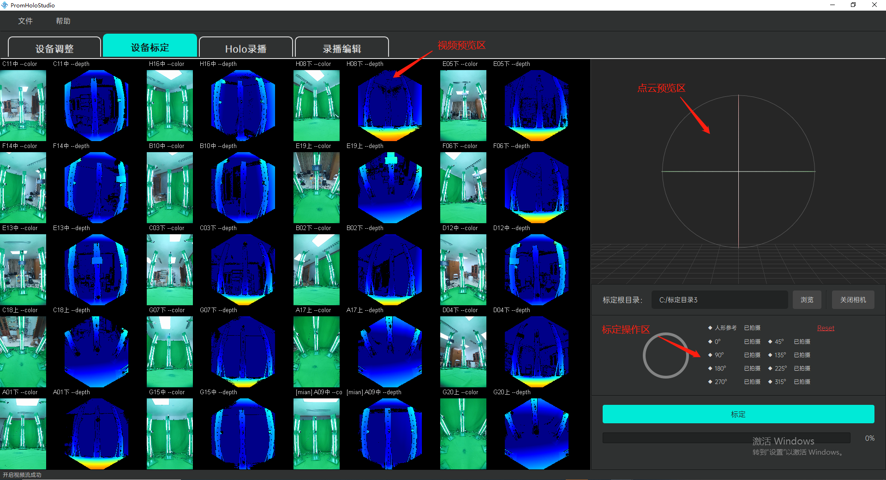
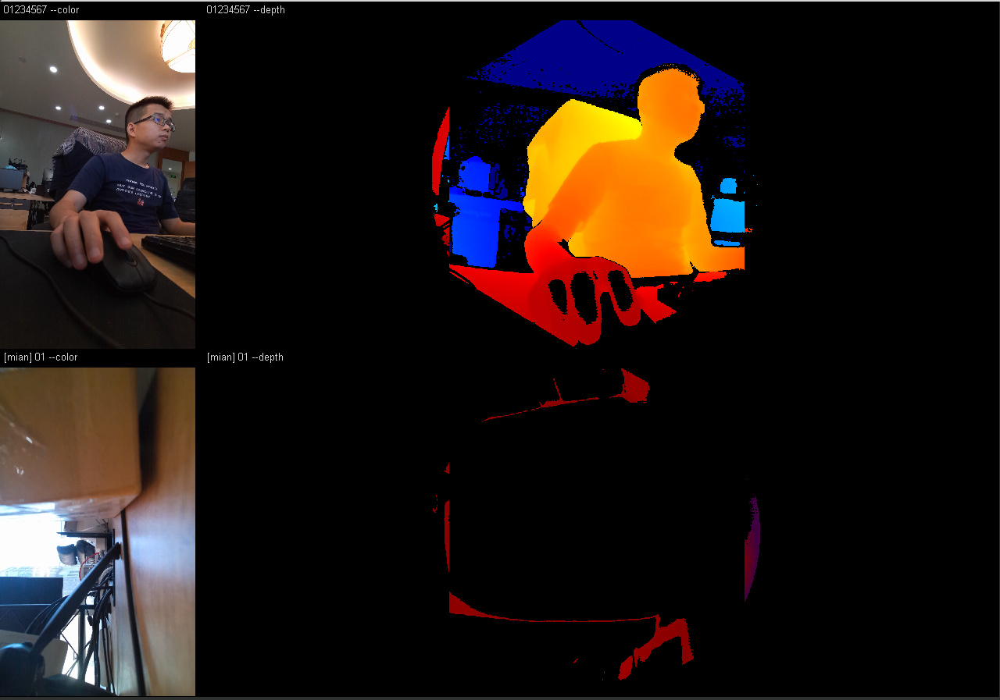
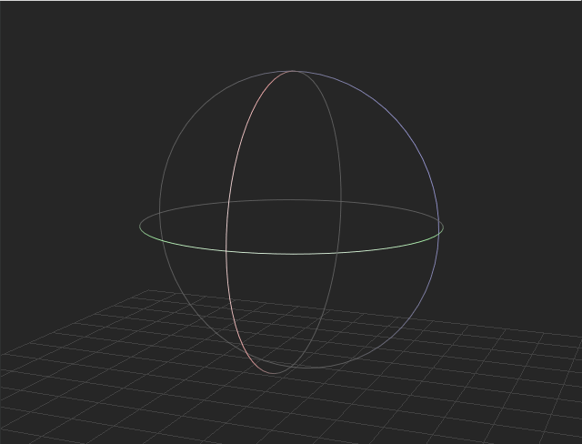

[返回](promholostudio.md#id_promholostudio)

#设备标定
## 功能介绍
设备标定模块需要使用与全息容积拍摄影棚相配套的标定架，结合系统程序的标定算法完成影棚相机阵列的相机标定工作。该环节处理结果的好坏将直接影响人体容积视频的呈现质量。界面上分为左边的[视频预览区](#deviceSetting_previewArea)、左上方的[点云预览区](#deviceSetting_pointcloudArea)和左下方的[标定操作区](#deviceSetting_calibArea)

## 操作指南
###视频预览区
视频预览区采用类似九宫格的矩阵排列方式，显示当前所有接入系统相机的视频画面预览。每台相机在各自画幅上均按照左边彩色图右边深度图的方式予以布局，彩色图/深度图上方将显示该相机的相机名称-图像类型后缀（例如：相机00的彩色图为00-color，对应的深度图为00-depth），而如果该相机是主相机的话，则会在相机名称前冠以[main]字样（例如：相机00为主相机，其彩色图为[main]00-color，对应的深度图为[main]00-depth）。

###点云预览区
点云预览区将对标定完成后的人体点云模型予以显示和预览。用户可以通过鼠标或键盘操控点云模型的观察视角，依据其与真实人体的贴合程度直观上大致判断标定结果的好坏。

**支持的鼠标/键盘操作**：
* 鼠标滚轮：视角缩放。
* 鼠标左键拖拽：视角旋转。
* 鼠标中键拖拽：视角平移。
* 键盘R键：视角重置。

<!--  -->

###标定操作区
标定操作区负责引导用户完成影棚相机阵列的相机标定工作。具体操作流程如下：

#### 1.指定标定根目录

用户在文本框当中输入标定任务的根目录路径（也可点击“浏览”按钮，在弹出的路径选择弹窗中选择指定该路径），该目录将存储标定所需的素材照片以及标定算法生成的各种中间文件。
*注意：当从其他功能模块跳转到设备标定模块时，将弹出标定根目录的设定弹窗，用户也可以在该弹窗当中先行设定该目录路径。*

#### 2.打开/关闭相机
 / 
用户点击“打开相机”按钮，将刷新、打开所有接入系统的相机设备（该操作将核对当前接入系统的相机设备授权信息，对于非法授权的相机设备将不予以支持，具体请参考[相机授权](promholostudio.md#CameraLicense)部分的描述）；成功打开相机后，用户可以再次点击该按钮（此时该按钮显示“关闭相机”字样）关闭所有的相机设备。
*注意：有可能因设备连接不良而导致某些相机设备无法刷新/打开，此时用户需根据软件的反馈检查相机设备的连接情况，尝试重新拔插设备并再次刷新、打开相机。*

#### 3.拍摄标定素材

用户在设定好标定根目录并且成功打开相机之后，需要按照系统提示，结合全息容积影棚配套的标定架依次拍摄指定张数的标定素材照片。拍摄顺序如下：

1. 用户进入影棚正中央，正面面朝[主相机](page_deviceSetting.md#id_page_deviceSetting_mainCamera)，双手双脚自然朝身子两侧稍稍打开，身体摆呈字母A样式垂直站立不动。另一位操作员用户点击标定操作区的拍摄按钮，拍摄第一张标定素材“人形参考”。

2. 将全息容积影棚配套的标定架摆入影棚正中央，标定架正面（也即棋盘格标定板正面）正对[主相机](page_deviceSetting.md#id_page_deviceSetting_mainCamera)并以此角度作为“0°”参考。操作员用户点击标定操作区的拍摄按钮，拍摄“0°”标定架素材；拍摄完成后，将标定架以相对于上一次标定架摆设角度顺时针旋转45度，再次拍摄一组标定架素材，以此类推，直到将标定架旋转一周为止，一共拍摄8组不同角度的标定架素材。

*注意：“人形参考”以及8组标定架拍摄角度未完成拍摄之前，标定操作区的拍摄提示将显示“未拍摄”字样，每完成一组拍摄后对应的拍摄提示将变更为“已拍摄”。点击标定操作区的“Reset”按钮将清空当前标定根目录下的所有文件，方便用户重新拍摄标定素材。*

#### 4.设备标定

用户完成标定素材的拍摄后，标定按钮将激活可用，点击标定按钮即可开始进行设备标定；按钮下方的进度条以及相应弹出的系统弹窗将显示标定的进度。标定完成后，[点云预览区](#deviceSetting_pointcloudArea)将显示之前拍摄“人形参考”标定素材的人体点云模型；如果标定失败，系统将提示用户重新拍摄标定素材并尝试再次进行设备标定。（*标定过程将占用大量的算力资源，并且持续时间较长，请用户耐心等待。*）