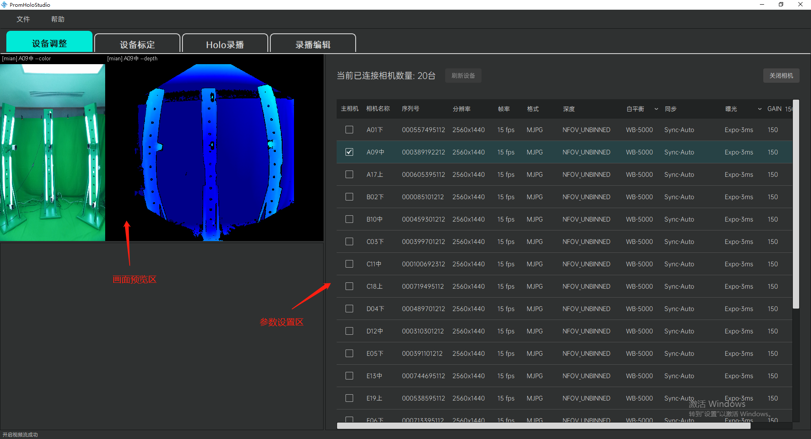
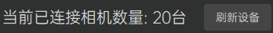

[返回](promholostudio.md#id_promholostudio)

#设备调整
## 功能介绍
设备调整模块负责对接入系统的相机设备进行相关参数的调整和画面预览。界面上分为左边的[视频预览区](#deviceSetting_previewArea)和右边的[参数设置区](#deviceSetting_settingArea)

## 操作指南
###视频预览区
视频预览区将显示当前选中的已打开相机的视频画面预览，其中画面左边部分显示该相机的彩色图，右边部分显示该相机的深度图。彩色图/深度图上方将显示该相机的相机名称-图像类型后缀（例如：相机00的彩色图为00-color，对应的深度图为00-depth），而如果该相机是主相机的话，则会在相机名称前冠以[main]字样（例如：相机00为主相机，其彩色图为[main]00-color，对应的深度图为[main]00-depth）。

###参数设置区
参数设置区将引导用户对当前接入系统的相机设备进行相关参数的调整。具体操作流程如下：

#### 1.刷新设备

用户点击刷新设备按钮将刷新当前已接入系统的相机设备信息，并在按钮左边向用户展示当前相机的接入数量。
*注意：有可能因设备连接不良而导致某些相机设备刷新不出或者刷新失败，此时用户需根据软件的反馈检查相机设备的连接情况，尝试重新拔插设备并再次刷新。*

####2.打开/关闭相机
 / 
用户在成功刷新设备后，点击“打开相机”按钮将打开所有接入系统的相机设备；成功打开相机后，[视频预览区](#deviceSetting_previewArea)将显示当前选中相机的视频画面预览；用户再次点击该按钮（此时该按钮显示“关闭相机”字样）将关闭所有的相机设备。打开相机操作将核对当前接入系统的相机设备授权信息，对于非法授权的相机设备将不予支持，具体请参考[相机授权](promholostudio.md#CameraLicense)部分的描述。
*注意：有可能因设备连接不良而导致某些相机设备无法打开，此时用户需根据软件的反馈检查相机设备的连接情况，尝试重新拔插设备并再次刷新、打开相机。*

#### 3.参数设置

用户在成功刷新设备后，即可在下方显示当前接入系统的相机设备信息列表。列表详细列举了当前相机设备的各类参数，并提供了相应的表格控件以便用户进行相应的设置和修改。用户可以使用表头控件如下拉框等，一次性修改所有相机的对应参数，也可以在表体当中鼠标选定某台相机设备，双击其列表项，使用表体控件来单独调整某台相机的具体参数。（被选中的相机在列表中高亮显示，如果此时相机已打开，则会在[视频预览区](#deviceSetting_previewArea)同步显示对应的相机预览画面）
*注意：除了[主相机](#id_page_deviceSetting_mainCamera)选择以及[相机名称](#id_page_deviceSetting_cameraName)这两个设定需要在表体中单独对每台相机进行调整设置之外，其余参数一般推荐使用表头控件统一调整，使得每台相机的对应参数保持一致，这样可以更好的保证系统的拍摄质量。*

**设备信息列表参数**：

* **<spand id = "id_page_deviceSetting_mainCamera">主相机**：指代全息容积拍摄影棚当中正对用户脸部的某台相机。用户初次使用本软件时，需要在成功刷新设备信息后，在设备信息列表的表体当中勾选指定。（*正确指定主相机关乎[设备标定](page_deviceCalib.md#id_page_deviceCalib)的运行结果，该环节不可省略。*）

* **<spand id = "id_page_deviceSetting_cameraName">相机名称**：用户初次使用本软件时，相机名称默认为数字序号（如00、01、02......）。用户成功刷新设备信息后，可以在设备信息列表的表体当中选中某台相机设备，双击其“相机名称”文本项，输入自定义的相机名称。（*最大支持4个中文字符或者8个英文字符。*）

* **序列号**：相机设备的唯一设备ID，仅用于显示，不可手动修改。

* **分辨率**：相机拍摄画面的彩色图像分辨率，支持1280x720、1920x1080、2560x1440三个档位。

* **帧率**：相机拍摄画面的帧率，支持5fps、15fps两个档位。（*默认推荐使用15fps档位*）

* **格式**：相机拍摄输出的影像格式，支持MJPG一个档位。

* **深度**：相机拍摄深度图的成像方式，支持NFOV_UNBINNED一个档位。

* **白平衡**：相机拍摄画面彩色图的白平衡，支持WB-Auto、WB-4000、WB-5000、WB-6000四个档位。（*系统默认采用WB-Auto档位，用户可以根据各自实际情况酌情调整。*）

* **同步**：全息容积拍摄影棚各相机数据流的同步方式，支持Sync-Auto一个档位。

* **曝光**：相机拍摄的曝光时长，支持Expo-Auto、Expo-3ms、Expo-10ms、Expo-20ms、Expo-30ms五个档位。（*系统默认采用Expo-3ms档位，用户可以根据各自实际情况酌情调整。*）

* **GAIN**：相机拍摄的亮度补偿，调节范围：1~255，值越大画面越亮（*系统默认值为200，用户可以根据各自实际情况酌情调整。*）

（*注意：以上参数信息，当相机处于打开状态时，仅可调节**主相机**、**白平衡**、**曝光**、**GAIN**四个参数，用户如果需要调整其他参数设置，请先[关闭相机](#DeviceSetting_OpenOrCloseCamera)*）