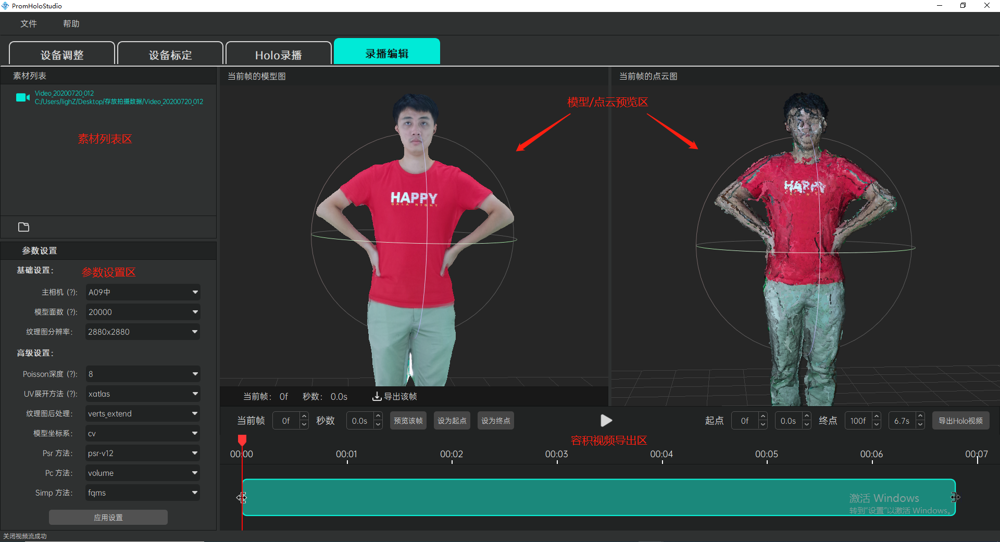
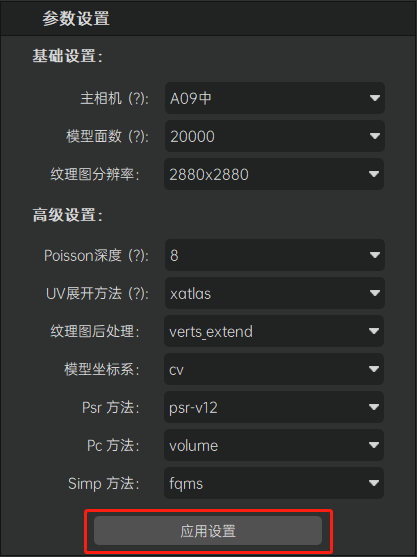
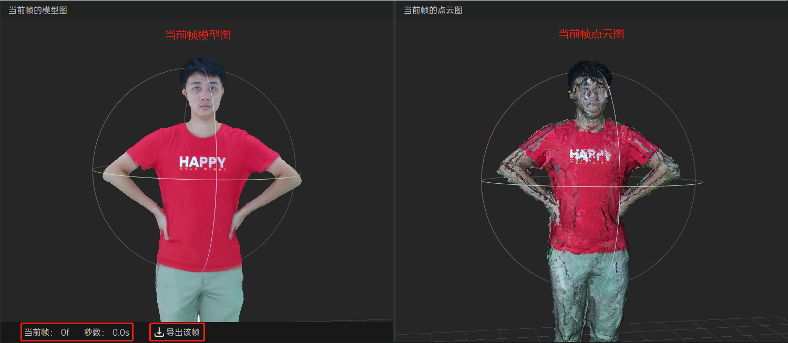
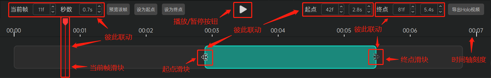

[返回](promholostudio.md#id_promholostudio)

#录播编辑
## 功能介绍
录播编辑模块为用户提供人体容积视频素材的预览、编辑和导出功能。界面上分为左上方的[素材列表区](#holoEdit_assetsArea)、左下方的[参数设置区](#holoEdit_settingArea)、右上方的[模型/点云预览区](#holoEdit_modelAndPointcloudPreviewArea)和右下方的[容积视频导出区](#holoEdit_exportArea)。

<!--  -->

## 操作指南
###素材列表区
素材列表区提供用户添加各种容积视频素材的功能。容积视频素材支持视频素材和照片素材两种（照片素材列表项图标为照相机，视频素材列表项图标为录像机）。点击素材列表左下方的“添加素材按钮”（按钮图标呈文件夹状），在弹出的文件夹选择弹窗当中选择相应的素材文件目录即可完成素材的添加操作（素材文件的目录指的是Holo录播模块拍摄出来的具体视频或者照片文件目录，其目录名称有特定的组织方式，例如 Video_20200620_001或者Photo_20200620_001等，具体请参考Holo录播模块下[拍摄容积视频素材](page_capture.md#capture_captureAssets)的具体描述）。

<!--  -->

###参数设置区
参数设置区为用户提供调整容积视频呈现质量相关参数的功能。系统默认为用户提供了一组比较平衡的参数配置，但是仍然保留自定义调整的高级功能以方便用户根据各自的实际情况进行必要的参数调整。参数说明如下：
* 主相机：一般设置为正对拍摄对象脸部的相机；指定主相机后将优先使用主相机的纹理图优化拍摄对象脸部建模的呈现效果。
* 模型面数：参数范围：6000 - 60000，模型面数越高则建模精度越高，但是系统性能开销也会越高。推荐范围10000 - 20000。
* 纹理图分辨率：指代容积视频纹理图的分辨率，分辨率越高则呈现质量越精细，但是文件也越大。
* Poisson深度：指代模型细节算法等级，参数范围：6 - 8，深度越深，模型细节越丰富。
* UV展开方法：指代纹理图UV的展开方法，xatlas方法更快，而其他的方法则连续性更好。
* 纹理图后处理：指代纹理拼接优化算法，启用该优化算法可能使得某些纹理间的拼接过渡更平滑自然，默认使用verts_extend方法。
* 模型坐标系：cv/cg坐标系，目前算法支持cv坐标系，该参数不建议改动。
* Psr方法：目前算法支持psr-v12方法，该参数不建议改动。
* Pc方法：目前算法支持volume方法，该参数不建议改动。
* Simp方法：目前算法支持fqms方法，该参数不建议改动。
*注意：当修改参数设置完成后，请不要忘记点击“应用设置”按钮以确保修改生效；修改效果将实时反馈显示在右上方的[模型/点云预览区](#holoEdit_modelAndPointcloudPreviewArea)当中。*

<!--  -->

###模型/点云预览区
模型/点云预览区将显示[素材列表](#holoEdit_assetsArea)当前素材其中某一帧的三维重建模型（见于左侧预览窗口）和对应的点云模型（见于右侧预览窗口）。用户可以通过鼠标或键盘对相应模型的观察视角进行操控。左侧模型预览窗口下方还将显示当前所预览的三维重建模型的帧序号以及对应的时间点（单位秒），点击其右侧的“导出该帧”按钮将生成导出一份单帧静态内容的三维重建模型文件（文件名后缀为.obj），该文件支持在如3ds Max、Maya、Sketchup、Blender、Houdini等许多主流建模软件当中查看使用。

**支持的鼠标/键盘操作**：
* 鼠标滚轮：视角缩放。
* 鼠标左键拖拽：视角旋转。
* 鼠标中键拖拽：视角平移。
* 键盘R键：视角重置。

<!--  -->

###容积视频导出区
容积视频导出区为用户提供当前目标容积视频素材的容积视频导出功能。具体描述如下：

* 用户在[素材列表](#holoEdit_assetsArea)当中添加一段容积视频素材后，容积视频导出区的视频进度条上方将显示该视频素材的时间刻度。
* 通过拖拽视频进度条的当前帧滑块，用户可以方便的在[模型/点云预览区](#holoEdit_modelAndPointcloudPreviewArea)右半部分的“当前帧点云图”预览窗口当中实时预览该帧的点云模型，与此同时，本区域左上方的“当前帧”和“秒数”步进器控件也将同步显示该帧的帧号以及对应的时间点；反过来用户也可以通过调整“当前帧”或者“秒数”步进器控件（这两者是联动的，具体看用户习惯于按帧数调整还是按秒数调整）来控制视频进度条的当前帧滑块并预览相应的点云模型。
* 点击本区域居中的“播放按钮”（按钮图标为竖三角状），可以在[模型/点云预览区](#holoEdit_modelAndPointcloudPreviewArea)右半部分的“当前帧点云图”预览窗口当中循环播放目标容积视频的点云模型动画，再次点击该按钮则停止播放。
* 点击本区域左上方的“预览该帧”按钮可以在[模型/点云预览区](#holoEdit_modelAndPointcloudPreviewArea)左半部分的“当前帧模型图”预览窗口当中预览该帧的三维重建模型。
* 点击本区域左上方的“设为起点”按钮，可以将当前帧滑块对应的帧号/时间点设置为导出目标容积视频的起点，该起点值将同步显示在本区域右上方的“起点”步进器当中，同时视频进度条左侧的“起点滑块”也将同步移动到进度条相应时间点位置。
* 点击本区域左上方的“设为终点”按钮，可以将当前帧滑块对应的帧号/时间点设置为导出目标容积视频的终点，该终点值将同步显示在本区域右上方的“终点”步进器当中，同时视频进度条右侧的“终点滑块”也将同步移动到进度条相应时间点位置。
* 拖拽视频进度条左侧的“起点滑块”，可以将该滑块对应的帧号/时间点设置为导出目标容积视频的起点，该起点值将同步显示在本区域右上方的“起点”步进器当中。
* 拖拽视频进度条左侧的“终点滑块”，可以将该滑块对应的帧号/时间点设置为导出目标容积视频的终点，该终点值将同步显示在本区域右上方的“终点”步进器当中。
* 调整本区域右上方的“起点”步进器控件的值（调整起点帧或者起点秒数都可以，这两者是联动的，具体看用户习惯于按帧数调整还是按秒数调整），可以设置导出目标容积视频的起点，这个调整也将同步更新“起点滑块”在视频进度条上的位置。
* 调整本区域右上方的“终点”步进器控件的值（调整终点帧或者终点秒数都可以，这两者是联动的，具体看用户习惯于按帧数调整还是按秒数调整），可以设置导出目标容积视频的终点，这个调整也将同步更新“终点滑块”在视频进度条上的位置。
* 指定好导出容积视频的起点和终点后（如果不指定，则默认导出整段完整的容积视频），点击本区域右上方的“导出Holo视频”按钮，在弹出的指引弹窗当中设置好导出文件的文件名和路径即可开始导出容积视频，导出过程可能费时较长，请耐心等待；待导出完成后将在指定目录下生成一份包含动态内容和音频（如果拍摄容积视频素材时包含了音频数据的话）的容积视频文件（文件名后缀为.mp4），配合使用我们提供的专门的播放工具/插件即可浏览播放。

<!--  -->

<!--  -->

<!--  -->

<!--  -->

