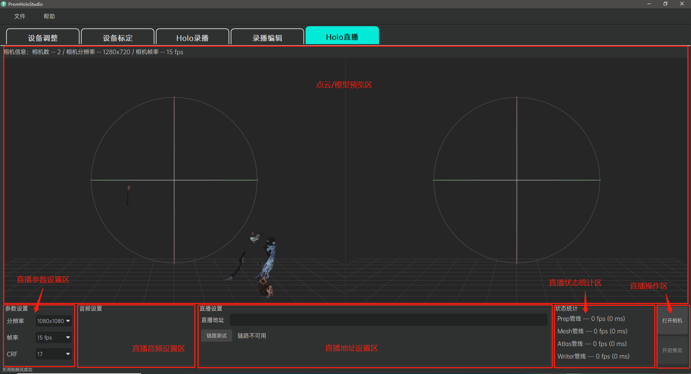
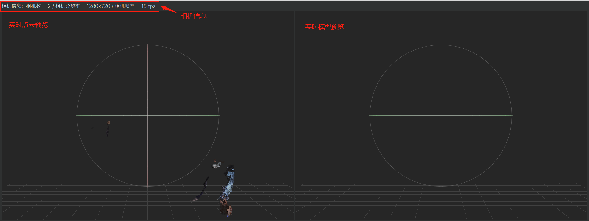
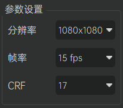
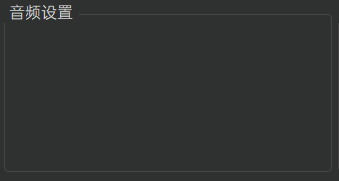
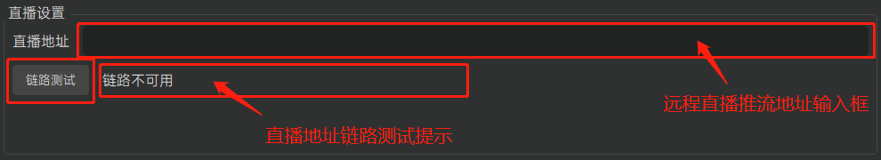
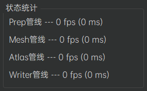
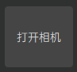
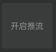
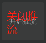

[返回](promholostudio.md#id_promholostudio)

#Holo直播
## 功能介绍
Holo直播模块为用户提供人体容积视频的在线直播功能。用户可以将当前在全息容积拍摄影棚当中的人体全息容积视频流，通过互联网实时推送到远端的直播地址上，然后配合使用我们提供的专门的直播播放工具访问该直播地址即可实现该容积视频的实时在线播放。界面上分为上方居中的[点云/模型预览区](#holoLive_pointcloudAndModelPreviewArea)、左下方的[直播参数设置区](#holoLive_settingArea)、[直播音频设置区](#holoLive_audioArea)、正下方的[直播地址设置区](#holoLive_addressArea)、右下方的[直播状态统计区](#holoLive_statusArea)和[直播操作区](#holoLive_operationArea)。

## 操作指南
###点云/模型预览区
点云/模型预览区将实时显示当前全息容积拍摄影棚中人体的点云模型（见于左侧预览窗口）和完整三维重建模型（见于右侧预览窗口）。用户可以通过鼠标或键盘对相应模型的观察视角进行操控。本区域上方还将显示当前全息容积拍摄影棚当中接入系统的相机信息（包括相机数量、相机的分辨率和相机帧率等）以供用户参考。

**支持的鼠标/键盘操作**：
* 鼠标滚轮：视角缩放。
* 鼠标左键拖拽：视角旋转。
* 鼠标中键拖拽：视角平移。
* 键盘R键：视角重置。

###直播参数设置区
直播参数设置区为用户提供调整容积视频直播画质质量相关参数的功能。系统默认为用户提供了一组比较平衡的参数配置，但是仍然保留自定义调整的高级功能以方便用户根据各自的实际情况进行必要的参数调整。参数说明如下：

* 分辨率：指代直播容积视频纹理图的分辨率，系统提供480x480、720x720和1080x1080三个档位，默认值为1080x1080。分辨率越高则直播画面呈现质量越精细，但是直播推流的数据量也越大，更有可能造成直播的高延迟。
* 帧率：指代直播容积视频的播放帧率，系统提供5 fps和15 fps两个档位，默认值为15 fps。帧率越高则画面呈现效果越流畅，但是系统性能开销也会越高，直播推流的数据量也越大，更有可能造成直播的高延迟。
* CRF：指代容积视频传输的码流压缩率，系统提供17、21和24三个档位，默认值为17。CRF值越小代表码流压缩率越小，画质越无损，但是直播推流的数据量也越大，更有可能造成直播的高延迟。

*注意：由于用户的网络状况各不相同，请根据实际情况酌情平衡直播的画质和网络延迟。*

###直播音频设置区
直播音频设置区为用户提供调整容积视频直播音频质量相关参数的功能。

###直播地址设置区
直播地址设置区为用户提供指定远程直播推流地址的功能。用户在远程直播推流地址输入框中输入相应的远程直播推流地址（如https://192.168.1.101:8080/live），点击下方的“链路测试”按钮，稍等片刻即可在按钮旁的链路测试提示当中看到该链路的测试结果。只有成功通过链路测试，才能开启容积视频的在线直播功能。

###直播状态统计区
直播状态统计区为用户显示当前系统用于处理容积视频直播的各个工作管线的状态信息。各工作管线的状态以处理帧率和花费毫秒数直观呈现；各管线帧率越高、花费毫秒数越小，表明系统工作状态越好，直播也越顺畅。
*Tips：当用户遇到直播问题时，可以给直播状态统计区截图并反馈给我们，这能有效的帮助我们尽快定位具体问题*。

###直播操作区
直播操作区负责引导用户使用人体容积视频的在线直播功能。具体操作流程如下：

#### 1.打开/关闭相机
 / 
用户点击“打开相机”按钮，将刷新、打开所有接入系统的相机设备（该操作将核对当前接入系统的相机设备授权信息，对于非法授权的相机设备将不予以支持，具体请参考[相机授权](promholostudio.md#CameraLicense)部分的描述）；成功打开相机后，[直播状态统计区](#holoLive_statusArea)中显示的除Writer管线之外的其他管线将开始工作，而[点云/模型预览区](#holoLive_pointcloudAndModelPreviewArea)也将实时显示当前全息容积拍摄影棚中人体的点云模型和完整三维重建模型；用户再次点击该按钮（此时该按钮显示“关闭相机”字样）将关闭所有的相机设备，而如果当前正在进行直播推流，则该操作将停止推流，且[直播状态统计区](#holoLive_statusArea)中显示的所有管线也将停止工作。
*注意：有可能因设备连接不良而导致某些相机设备无法刷新/打开，此时用户需根据软件的反馈检查相机设备的连接情况，尝试重新拔插设备并再次刷新、打开相机。*

#### 2.开启/关闭推流
 / 
用户在成功打开相机并且[正确设置直播地址](#holoLive_addressArea)后，点击“开启推流”按钮，此时[直播状态统计区](#holoLive_statusArea)中显示的Writer管线将开始工作，该管线会把当前全息容积拍摄影棚中的人体全息容积视频流实时推送到远端的直播地址上；用户再次点击该按钮（此时该按钮显示“关闭推流”字样）将停止Writer管线的推流工作。
*注意：直播容积视频需要配合使用我们提供的专门的直播播放工具，访问对应的直播地址才能实现该直播的实时在线浏览。*

