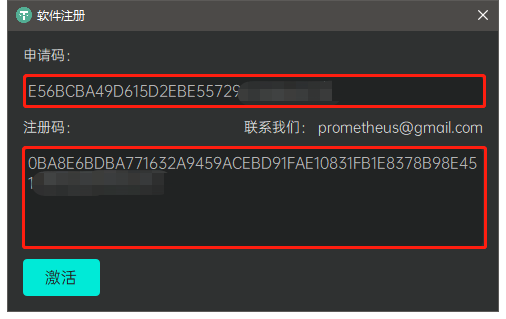

# PromHoloStudio 使用教程

## PromHoloStudio简介

PromHoloStudio软件是由深圳普罗米修斯视觉技术有限公司开发的软件系统，用户结合配套提供的全息容积视频拍摄影棚，可以方便的进行人体容积视频的本地采集、后续编辑以及实时在线直播等相关操作。

## PromHoloStudio功能模块

* [设备调整](#DeviceSetting)
* [相机标定](#DeviceCalib)
* [Holo录播](#HoloCapture)
* [录播编辑](#HoloEdit)
* [Holo直播](#HoloLive)（可选）

## 准备工作
* [软件注册](#Registration)
* [相机授权](#CameraLicense)

###软件注册
用户初次使用本软件时将弹出软件注册弹窗，请联系我们(<prometheus@gamil.com>)，将弹窗展示的软件申请码通过Email或者其他方式提供给我们，核实相关信息后我们将把对应的软件注册码发送给您，请将其粘贴到注册弹窗的注册码输入区域，点击激活按钮即可完成本软件的激活注册。

###相机授权
用户全息容积视频拍摄影棚的相机设备发生变更时，请联系我们(<prometheus@gamil.com>)，将变更相机的设备ID通过Email或者其他方式提供给我们，核实相关信息后我们将把对应的相机授权dll文件发送给您，通过替换相应目录

## 开始使用

新用户初次使用本软件时将按照 [设备调整](#DeviceSetting) > **相机标定** 的流程完成基本的系统初始化工作，待 **相机标定** 完成后，用户可以使用 **Holo录播** 模块进行人体容积视频的本地采集，然后使用 **录播编辑** 模块完成人体容积视频的预览、编辑和导出。购买了**Holo直播** 模块的用户还可以直接在该模块当中进行人体容积视频的实时在线直播。

###设备调整
###相机标定
###Holo录播
###录播编辑
###Holo直播